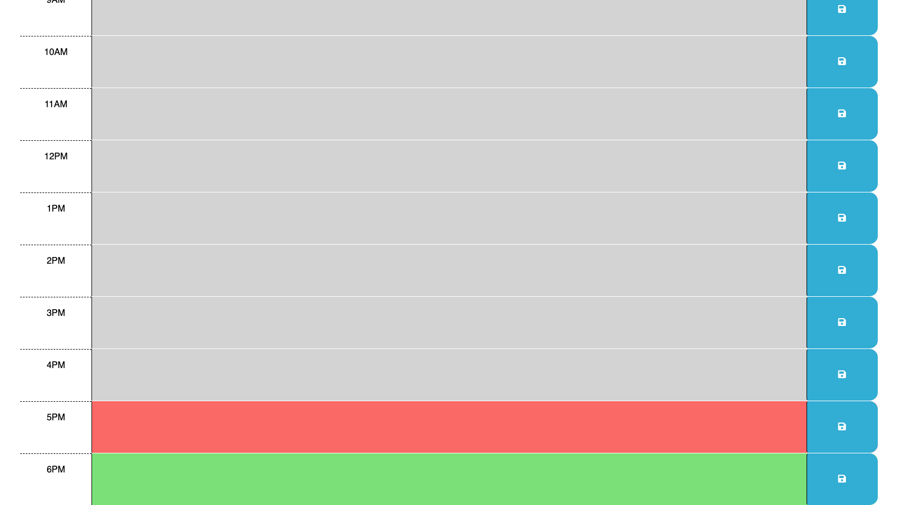
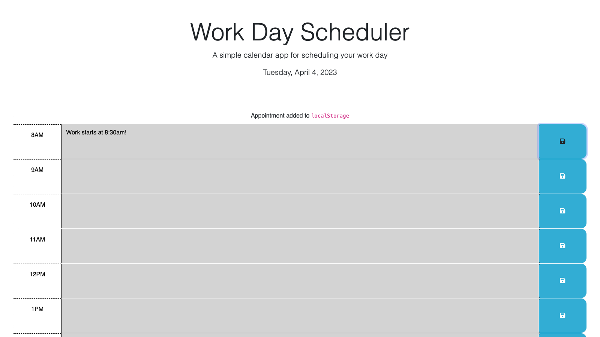

# Work Day Scheduler

This is a site that allows you to keep track of your work schedule. The schedule shows times from 8am to 6pm. My work day is from 8:30am to 5:30pm so I extended the times to make it fit my schedule. Upon saving an event it is logged to the local storage and is saved for when you return.

## USER STORY

As a user,
I want to create work day schedule,
so that I can save and keep track of tasks and events throughout my work day.

## ACCEPTANCE CRITERIA

Given a a schedule containing my work hours,
when I enter an even or task,
then it is saved to my local storage.
When I return to the schedule,
then the evens I've entered will still be there.

## Deployed Site and Screenshots

